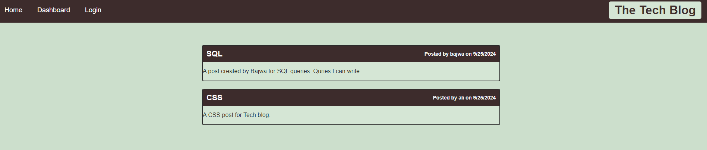
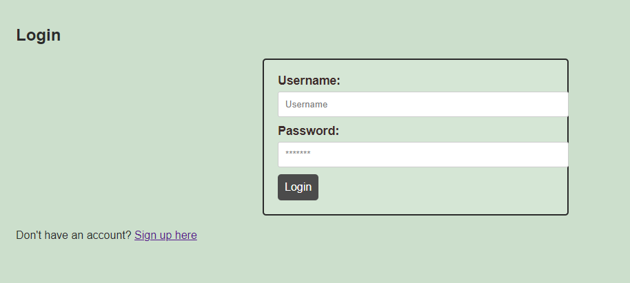
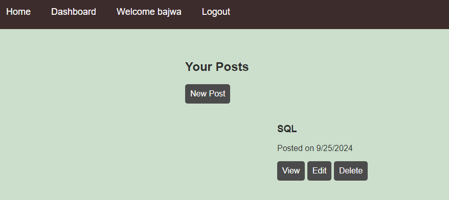

# Tech Blog

## Description

Tech Blog is a CMS-style blog site where developers can publish their blog posts and comment on other developers' posts. This application follows the MVC paradigm, uses Handlebars.js as the templating language, Sequelize as the ORM, and includes authentication using express-session.

## Table of Contents

- [Installation](#installation)
- [Usage](#usage)
- [Features](#features)
- [Technologies Used](#technologies-used)
- [Contributing](#contributing)
- [License](#license)

## Installation

1. Clone the repository to your local machine.
2. Navigate to the project directory.
3. Run `npm install` to install the necessary dependencies.
4. Set up your PostgreSQL database.
5. Create a `.env` file in the root directory and add your database credentials and session secret:

```
DB_NAME='your_database_name'
DB_USER='your_database_user'
DB_PASSWORD='your_database_password'
SESSION_SECRET='your_session_secret'
```

6. Run `npm start` to start the server.

## Usage

After installation, you can access the application by navigating to `http://localhost:3000` in your web browser. From there, you can:

- View existing blog posts on the homepage
- Sign up for an account or log in
- Create, update, and delete your own blog posts
- Comment on blog posts


You can use the online deployed version to test the application

[TechBlog](https://techblog-9qhc.onrender.com/)

## Features

- User authentication (signup, login, logout)
- Create, read, update, and delete blog posts
- Comment on blog posts
- Responsive design for various screen sizes
- Session timeout for security

## Technologies Used

- Node.js
- Express.js
- Handlebars.js
- Sequelize ORM
- PostgreSQL
- express-session for authentication
- bcrypt for password hashing
- dotenv for environment variables

## Screen Shots





## Contributing

Contributions to improve Tech Blog are welcome. Please follow these steps to contribute:

1. Fork the repository
2. Create a new branch (`git checkout -b feature/AmazingFeature`)
3. Commit your changes (`git commit -m 'Add some AmazingFeature'`)
4. Push to the branch (`git push origin feature/AmazingFeature`)
5. Open a Pull Request

## License

This project is licensed under the MIT License.

---

For any additional questions or concerns, please contact the
[zainabid333](https://github.com/zainabid333/TechBlog)
